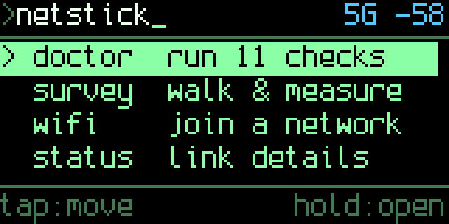
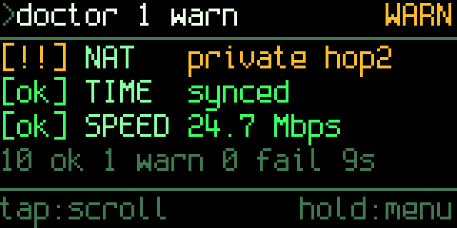
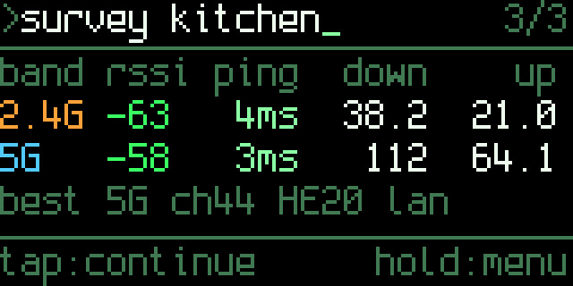

# netstick

Firmware for the **LilyGO T-Dongle-C5** (ESP32-C5, dual-band Wi-Fi 6, 16MB flash,
8MB PSRAM, 0.96" 160x80 ST7735, microSD, APA102 LED, one button) that turns it
into two tools:

- **wifi** - set the network from your phone through a captive portal; nothing to compile in.
- **doctor** - plug it into any USB port on any Wi-Fi network and get a graded
  report card in about 30 seconds: link, DHCP, gateway, DNS (including NXDOMAIN
  hijack detection), raw internet reachability, captive portal, TLS
  interception, IPv6, NAT type (single / double / CGNAT via a mini traceroute),
  time sync and a download speed figure.
- **survey** - walk the building. At every spot, tap: the stick scans for your
  SSID on both bands, measures RSSI, gateway latency and up/down throughput on
  the band it is on, hops to the strongest AP on the *other* band and measures
  that too, then appends everything to a CSV on the SD card.

Terminal look, [Spleen](https://github.com/fcambus/spleen) bitmap font (6x12
body, 12x24 for the big numbers), ASCII-only art. Written against ESP-IDF v5.5.

| | |
|---|---|
|  |  |
|  |  |

The `hw-` images are frames pulled from the panel over USB; the rest come from
the native simulator in `sim/`. All 30 screen states are in `docs/screens/`.

## One button, two gestures

| Gesture | Meaning, everywhere |
|---|---|
| **tap** (press and release) | next / advance: move the cursor, next page, mark a spot |
| **hold** (0.55 s) | select / menu: open the item under the cursor, or the context menu |

The footer always spells out what the two gestures do on the current screen,
and fills up from the left while the button is held so a hold never fires by
surprise. Every context menu has a way home.

```
>netstick_            5G -58        >doctor 1 warn_          WARN
                                    [ok] LINK  -58dBm 5G ch44
> doctor  run 11 checks             [ok] DHCP  10.0.0.42
  survey  walk & measure            [ok] GW    3ms 0% loss
  wifi    join a network            [!!] DNS   nxdomain hijack
  status  link details
tap:move            hold:open       tap:scroll          hold:menu
```

The LED mirrors state: green with an address, amber while joining, red with no
link, blue breathing while a doctor run or a survey sample is in progress, and
the doctor's verdict colour once it finishes.

## Screens

Home menu order: doctor, survey, wifi, status, setup, saver.

### doctor

Starts running the moment you open it. Rows appear as checks complete:

| Tag | Meaning |
|---|---|
| `[ok]` | pass |
| `[!!]` | warning, keeps going |
| `[xx]` | fail. A failed LINK or DHCP skips everything after it (`[--]`) |

**tap** pages through the 11 rows plus a summary line. **hold** opens the menu:
*details* (tap steps through a 3-line explanation per check), *run again*, *home*.

The full report is also printed on the USB console and, with a card inserted,
written to `/sd/doctor/<date>-<time>.txt`.

| Check | Pass | Warn | Fail |
|---|---|---|---|
| LINK | associated, RSSI ≥ -70 | RSSI -70..-80 | not joined (shows the driver's reason, e.g. `bad password?`) |
| DHCP | address, gateway and DNS | no DNS handed out, or > 5 s | no offer in 12 s |
| GW | gateway answers ping | no ICMP reply, > 20% loss or > 100 ms | |
| DNS | google / cloudflare / example resolve, bogus name gets NXDOMAIN | partial, slow (> 500 ms) or NXDOMAIN hijack | nothing resolves |
| WAN | 1.1.1.1 or 8.8.8.8 answer | > 25% loss or > 250 ms | neither answers |
| PORTL | `generate_204` returns 204 | odd status | redirect (captive portal, shows where), content swap, or port 80 blocked |
| TLS | https to google verifies against the bundled roots | | certificate failure (interception, or clock not set yet), or 443 blocked |
| IPV6 | global address and ping6 works | no global address (very common) or address without route | |
| NAT | public IP found, single NAT | second hop is private (double NAT, or an ISP-internal hop), CGNAT (100.64/10) | |
| TIME | SNTP synced | not yet | |
| SPEED | ≥ 20 Mbit/s over 4 s from `SPEED_URL` | slower, or URL unreachable | |

### survey

Opening it starts a session (a new CSV). The live view shows the current
RSSI big, the band / channel / PHY, and a signal bar. Walk to a spot and
**tap**. The sample takes about 25 seconds with both bands enabled and shows
its progress:

```
>survey kitchen_      5G -58
measuring kitchen      [5/9]
5G download (lan)
[##############..........]
\ 14s  lan server
tap:-             hold:cancel
```

then a result card, after which **tap** returns to the live view for the next
spot:

```
>survey kitchen_         3/3
band rssi  ping  down    up
2.4G -63    4ms  38.2  21.0
5G   -58    3ms   112  64.1
best 5G ch44 HE20 lan
tap:continue       hold:menu
```

**hold** opens the menu: *resume*, *review points* (tap steps through every
spot), *bands: both / current only*, *end session, home*.

Spots are labelled `P1`, `P2`, ... unless `/sd/survey/rooms.txt` exists, in
which case its lines are used in order (`kitchen`, `garage`, ...).

### wifi

Joins the stick to a network anywhere, no laptop needed. *setup via phone*
scans for networks, then raises an open hotspot named `netstick-XXXX` with a
captive portal:

```
>wifi setup_           AP up
on your phone, join wifi
  netstick-bdd1
then open (if no popup)
  http://192.168.4.1
tap:-              hold:cancel
```

Join it from a phone; the "sign in to network" sheet opens a page listing the
networks the stick can see. Pick one (or type a hidden SSID), enter the
password, press connect. The hotspot goes away, the stick joins, and the
screen shows `joined <ssid>` with the address, or the driver's reason for
failing (`bad password?`, `no AP found`). Credentials persist in NVS, so it
rejoins on every power-up. The menu also offers *rejoin* and *forget network*.

The hotspot is open and only exists while this screen is showing; anyone
nearby could push credentials to the stick during that window.

### saver

A DedSec skull drawn in characters over a field of mutating hex and symbol
noise, with row tearing in red and cyan every couple of seconds and the eye
sockets flashing shut now and then. Any press returns home. *auto saver* in
setup starts it after 2, 5 or 10 idle minutes on the home screen.

### status

Three pages (tap): link (SSID, BSSID, band, channel, negotiated PHY, width,
signal), addresses (IPv4, gateway, DNS, IPv6) and device (uptime, drops, SD,
heap, time sync, DHCP time). The menu offers *rejoin wifi*.

### setup

Brightness (100 / 50 / 15 %), whether the survey measures both bands, and the
auto screensaver delay. All persist in NVS.

## Setup

### 1. Toolchain

```sh
git clone --depth 1 -b v5.5.5 --recursive https://github.com/espressif/esp-idf.git ~/esp/esp-idf
cd ~/esp/esp-idf && ./install.sh esp32c5
. ~/esp/esp-idf/export.sh
```

### 2. Credentials

```sh
cp main/secrets.example.h main/secrets.h
```

Wi-Fi credentials are entered from a phone (see **wifi** below) and stored in
NVS, so `secrets.h` only needs editing if you want a different `SPEED_URL` or
time zone. `WIFI_SSID` / `WIFI_PASS` in it are optional seeds for the first
boot and are ignored while they are the placeholder. `secrets.h` is gitignored.

### 3. Build and flash

```sh
idf.py set-target esp32c5
idf.py -p /dev/cu.usbmodem* flash monitor
```

On macOS the USB-Serial-JTAG port can go silent after esptool's line-toggle
reset ("No serial data received" on the next attempt). Replug once, then flash
with a watchdog reset instead, which keeps the port alive:

```sh
python -m esptool --chip esp32c5 -p /dev/cu.usbmodem* -b 921600 --after watchdog_reset \
    write_flash --flash_mode dio --flash_size 16MB --flash_freq 80m \
    0x2000 build/bootloader/bootloader.bin 0x8000 build/partition_table/partition-table.bin 0x10000 build/netstick.bin
```

## The LAN throughput server

Wi-Fi throughput should be measured against something on the LAN, not the
internet, so the survey talks to a tiny Python server. Run it on a machine
plugged into the router by Ethernet (or at least sitting next to it):

```sh
python3 tools/survey_server.py
```

It answers the stick's UDP broadcast on port 7777, so no configuration is
needed when both are on the same subnet. Otherwise set `SURVEY_SERVER` in
`secrets.h`. Without a server the survey falls back to an HTTP download from
`SPEED_URL` and records no upload figure.

## Reading a survey

```sh
python3 tools/survey_report.py /Volumes/DONGLE/survey/20260902-101500.csv
```

prints a table and writes a self-contained HTML report next to the CSV with
signal and throughput bars per spot and band. No dependencies.

CSV columns: `point,label,iso_time,band_ghz,bssid,channel,rssi_dbm,
scan_rssi_dbm,phy,bw_mhz,ping_avg_ms,ping_max_ms,loss_pct,dl_mbps,ul_mbps,
speed_src,note`. Two rows per spot (one per band); a band that was not visible
or could not be joined has empty measurements and a `note`.

## The SD card must be FAT32

ESP-IDF's FatFs is built without exFAT and there is no Kconfig option to enable
it. Cards over 32GB ship exFAT, so a stock 64GB card will not mount and the boot
screen says `sd: no card / not FAT32`. On macOS:

```sh
diskutil list                                    # find the card, e.g. disk4
diskutil eraseDisk FAT32 DONGLE MBRFormat /dev/disk4
```

Everything works without a card; the doctor report and survey rows are always
echoed to the USB console, so `idf.py monitor` (or any serial terminal) is a
fine substitute.

## Checking screens without the hardware

`sim/` compiles the real drawing code (`gfx.c`, `ui.c`, the boot screen in
`app_main.c`) natively against stub drivers and renders every screen state:

```sh
cc -std=gnu11 -I sim/stubs -I main -o sim/netstick-sim sim/sim_main.c main/gfx.c
./sim/netstick-sim            # writes sim/out/*.raw
python3 -c "import sys,glob; sys.path.insert(0,'tools'); from fbview import png
for r in glob.glob('sim/out/*.raw'): png(r[:-4]+'.png', open(r,'rb').read(), 160, 80, 4)"
```

`docs/screens/` holds the current set. For the real panel, build with the
*netstick → Debug* Kconfig option (or `-DSDKCONFIG_DEFAULTS="sdkconfig.defaults;sdkconfig.debug"`)
and drive it over the console:

```sh
python3 tools/fbview.py --script "w12,d,t,d,h,w2,d" --out /tmp/screens
```

`t` taps, `h` holds, `d` dumps the current frame, `wN` waits N seconds.
The frames come back as PNGs.

## Hardware notes

- **No USB-OTG.** The C5 has only a USB Serial/JTAG controller; to a host the
  stick is a CDC serial port, nothing else.
- **One radio.** 2.4 GHz and 5 GHz are not simultaneous; that is why the survey
  hops between bands rather than measuring both at once. Switching takes a few
  seconds and is the bulk of a sample's duration.
- **LCD and SD share SPI2** with separate CS lines; the bus is initialised once
  in `board_spi_init()`.
- **Backlight is GPIO0, active low**, dimmed with LEDC.
- **Button is GPIO28**, active low, internal pull-up. It is also the boot strap,
  so holding it while plugging in enters the ROM downloader.
- **Scanning goes off-channel.** The survey's scan pauses the link for a few
  seconds; nothing else scans in the background.
- **Throughput ceiling.** With 64 kB TCP windows and 32-frame block acks
  (`sdkconfig.defaults`) the C5 manages well over 50 Mbit/s on a clean 5 GHz
  link. Slower numbers are the air, not the stick.

## Restoring the stock firmware

```sh
python -m esptool --chip esp32c5 -p /dev/cu.usbmodem* write_flash 0x0 \
    stock-firmware/T-Dongle-C5-Factory_V1.4_0616.bin
```

## Layout

```
main/
  app_main.c    boot sequence and logo
  board.h       pin map
  display.c     ST7735 init + framebuffer blit
  gfx.c         primitives and bitmap text (fonts/ is generated by tools/mkfont.py)
  button.c      tap / hold gesture detector
  netmgr.c      Wi-Fi station, NVS credentials, reconnect, SNTP, IPv6, pin-to-BSSID
  provision.c   phone setup: SoftAP + captive-portal DNS + HTTP form
  netprobe.c    synchronous ping, DNS timing, HTTP fetch, traceroute
  speed.c       LAN server discovery + TCP throughput
  doctor.c      the checks
  survey.c      session, per-band sampling, CSV
  ui.c          screens, menus, footer, LED
tools/
  survey_server.py   LAN throughput server (run on a laptop)
  survey_report.py   CSV -> table + HTML
  fbview.py          drive the UI over serial and grab frames
  mkfont.py          BDF -> C font header
sim/                 native renderer for the UI
archive/v1-dashboard the previous firmware (Wi-Fi survey / GitHub / fsociety)
```
